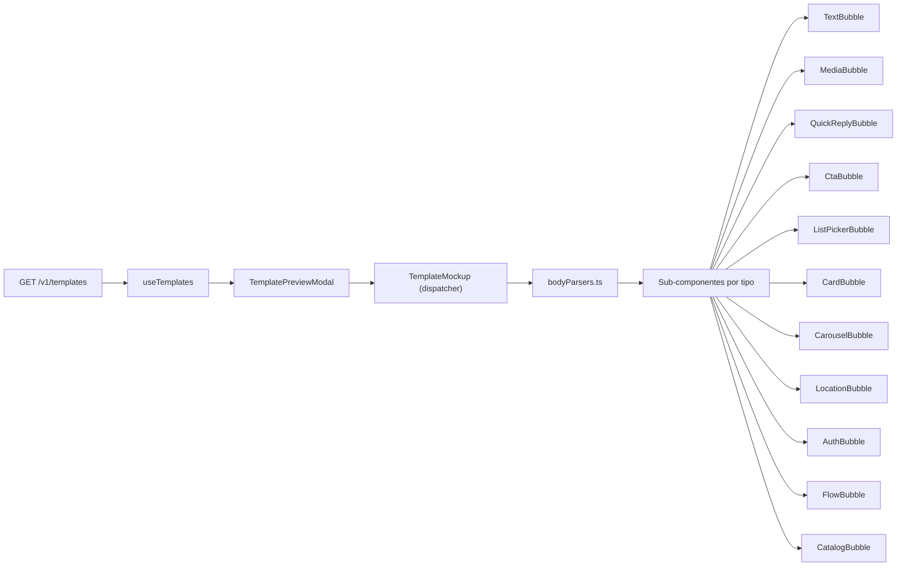

# Plano: Mockup de Template Dinâmico

## Contexto

Hoje `[front/src/features/templates/components/TemplateMockup.tsx](front/src/features/templates/components/TemplateMockup.tsx)` extrai apenas `body.body` como string e **descarta** qualquer outro campo (inclusive a variável `components` que ele prepara e ignora com `void components`). Todos os botões, itens de lista, títulos e mídias são rótulos fixos ("Resposta 1", "Acessar Link", "Título do Card", etc.).

O backend em `[back/src/modules/template/services/list-templates.service.ts](back/src/modules/template/services/list-templates.service.ts)` devolve `body = template.types[typeKey]`, ou seja, o payload bruto da Twilio com shapes distintos por `type` (`actions`, `items`, `cards`, `media`, `latitude/longitude`, etc.).

## Arquitetura alvo



## Estrutura de arquivos

```
front/src/features/templates/
  types.ts                          (refatorar: união discriminada)
  bodyParsers.ts                    (novo)
  components/
    TemplateMockup.tsx              (virar dispatcher enxuto)
    TemplatePreviewModal.tsx        (sem mudança)
    mockup/                         (novo diretório)
      MockupChassis.tsx             (chassi do celular + header)
      Bubble.tsx                    (bolha base reutilizável)
      ActionButton.tsx              (botão genérico com ícone)
      VariableChips.tsx             (render de {{n}} como chip)
      TextBubble.tsx
      MediaBubble.tsx
      QuickReplyBubble.tsx
      CtaBubble.tsx
      ListPickerBubble.tsx
      CardBubble.tsx
      CarouselBubble.tsx
      LocationBubble.tsx
      AuthBubble.tsx
      FlowBubble.tsx
      CatalogBubble.tsx
      FallbackBubble.tsx
```

## Camada 1: tipos discriminados em `types.ts`

Substituir `body: Record<string, unknown> | null` por uma união que cubra os shapes da Twilio Content API, mantendo `Record<string, unknown>` como *fallback* tolerante.

Tipos-chave: `TemplateAction` (discriminada por `type`: `URL | PHONE_NUMBER | QUICK_REPLY | COPY_CODE | OTP`), `TextBody`, `MediaBody`, `QuickReplyBody`, `CtaBody`, `ListPickerBody`, `CardBody`, `CarouselBody`, `LocationBody`, `AuthBody`, `FlowBody`, `CatalogBody`.

## Camada 2: `bodyParsers.ts`

Um módulo único que conhece os campos da Twilio e entrega dados prontos para renderizar.

Funções expostas:
- `getTypeKey(template)` — normaliza o `type` em lowercase
- `getBodyText(template)` — texto principal (`body` > `title` > `label` > "")
- `getMedia(template)` — array de URLs (vazio se ausente)
- `getActions(template)` — `TemplateAction[]`
- `getListItems(template)` — `{ button, items }`
- `getCards(template)` — `CardBody[]` (para carousel)
- `getCardPieces(template)` — `{ title, subtitle, media, actions }`
- `getLocation(template)` — `{ latitude, longitude, label, address }`
- `getAuthInfo(template)` — `{ expirationMinutes, recommendation, copyLabel }`
- `getFlowInfo(template)` — `{ body, footer, flowCta }`
- `splitVariables(text)` — transforma `"Oi {{1}}"` em segmentos `[{text}, {var:"1"}, ...]`

Todas retornam valores seguros (arrays vazios, `undefined`) quando o shape está ausente.

## Camada 3: sub-componentes por tipo

Cada bolha recebe `template: Template` e usa apenas os parsers. O chassi e a bolha base são reutilizados para manter o visual consistente.

Principais mudanças de fidelidade:

- **TextBubble** — texto com `VariableChips` destacando `{{1}}`, `{{2}}`.
- **MediaBubble** — `` quando existir, com `onError` para ícone; detecta vídeo/documento pela extensão e troca o ícone.
- **QuickReplyBubble** — mapeia `actions[].title` real, tantos botões quantos existirem.
- **CtaBubble** — mapeia `actions[]`, ícone por `type` (URL = `Globe`, PHONE_NUMBER = `Phone`, COPY_CODE = `Copy`).
- **ListPickerBubble** — texto do `button` e `items[]` reais (exibidos abaixo ou num popover interno ao mockup).
- **CardBubble** — `title`, `subtitle`, `media[0]` e botões vindos de `actions[]`.
- **CarouselBubble** — itera `cards[]`, cada card reaproveita `CardBubble`.
- **LocationBubble** — exibe `label`, `address` e coordenadas (`lat, lng`); opcionalmente um mapa estático via `` apontando para um provider público.
- **AuthBubble** — mostra `expira em X min` quando houver `code_expiration_minutes`; label do botão vem de `actions[0].title` quando presente.
- **FlowBubble** — `body`, `footer` em linha cinza e botão com `flow_cta`.
- **CatalogBubble** — `title`/`body`/`footer` reais; lista `items[]` quando houver.
- **FallbackBubble** — para `type` desconhecido, mostra o texto extraído e um accordion com JSON bruto do `body` em `<pre>` (ajuda depuração durante o rollout).

## `TemplateMockup` como dispatcher

O componente fica reduzido a: chassi + mapa `type -> componente` com *match* exato primeiro e *contains* como fallback (preserva back-compat com o código atual que usa `type.includes(...)`).

```ts
const renderers: Record<string, FC<{ template: Template }>> = {
  "twilio/text": TextBubble,
  "twilio/media": MediaBubble,
  "twilio/quick-reply": QuickReplyBubble,
  "twilio/call-to-action": CtaBubble,
  "twilio/list-picker": ListPickerBubble,
  "twilio/card": CardBubble,
  "twilio/carousel": CarouselBubble,
  "twilio/location": LocationBubble,
  "twilio/authentication": AuthBubble,
  "twilio/catalog": CatalogBubble,
  "whatsapp/flow": FlowBubble,
}
```

## Tratamento de variáveis `{{n}}`

`VariableChips` envolve cada `{{n}}` num `<span>` com destaque (amarelo claro/escuro), comunicando visualmente que aquele trecho é uma variável que precisa ser preenchida. Usado em todos os bubbles que têm texto.

## Estados vazios específicos

Cada sub-componente traz mensagens próprias quando o payload vem incompleto:
- Quick reply sem `actions` -> "Template sem botões configurados"
- Media sem URL -> "Mídia sem URL disponível"
- List picker sem `items` -> "Lista sem itens"
- Location sem coordenadas -> "Coordenadas ausentes"

Substitui o genérico "Conteúdo não especificado" atual.

## Compatibilidade e rollout

- `Template.body` continua aceitando `Record<string, unknown>` via união, então consumidores existentes (modal, listas, etc.) não quebram.
- O dispatcher mantém *contains* como fallback, cobrindo `type` eventualmente retornados com sufixos.
- Nenhuma alteração no backend é necessária — o schema já entrega `body` cru em `[back/src/modules/template/schemas/template.schema.ts](back/src/modules/template/schemas/template.schema.ts)`.

## Fora de escopo

- Substituição real das variáveis por valores de amostra (exigiria `variables`/`samples` do template, que não são retornados hoje).
- Editor de template / formulários.
- Testes automatizados dos parsers (podem ser adicionados em uma iteração seguinte, mas não bloqueiam o visual).