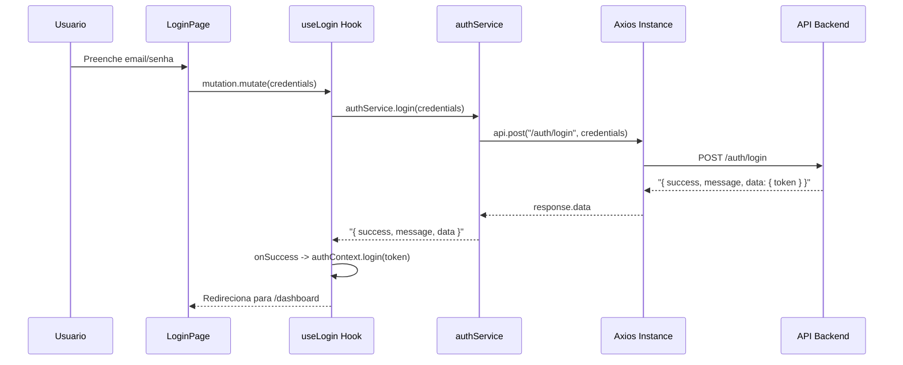

# Configuracao Inicial do Frontend + Pagina de Login

## Estado Atual

O frontend tem apenas o esqueleto basico: `App.tsx` com placeholder, componentes shadcn/ui prontos (Button, Input, Card, Label, Field/FieldError, Sonner), validacao de env vars e `tokenStorage` funcional. Nao existe nenhuma configuracao de roteamento, HTTP client, estado do servidor ou autenticacao.

## Arquitetura do Fluxo de Login




## Arquivos a Criar/Editar (em ordem de dependencia)

### 1. Types globais

**Criar** [front/src/types/api.ts](front/src/types/api.ts) -- Interface `ApiResponse<T>` que espelha a resposta padrao do backend:

```typescript
export interface ApiResponse<T> {
  success: boolean
  message: string
  data: T | null
}
```

### 2. Cliente HTTP (Axios)

**Criar** [front/src/lib/api.ts](front/src/lib/api.ts) -- Instancia Axios centralizada:

- `baseURL` de `env.VITE_API_BASE_URL`
- `timeout` de `env.VITE_API_TIMEOUT_MS`
- Request interceptor: injeta `Authorization: Bearer <token>` via `tokenStorage.get()`
- Response interceptor: trata 401 limpando o token e redirecionando para `/login` via `window.location.href`

### 3. QueryClient

**Criar** [front/src/lib/queryClient.ts](front/src/lib/queryClient.ts) -- Instancia do TanStack `QueryClient` com defaults:

```typescript
staleTime: 5 min, retry: 1, refetchOnWindowFocus: false
```

### 4. AuthContext

**Criar** [front/src/contexts/AuthContext.tsx](front/src/contexts/AuthContext.tsx):

- Estado: `token` (string | null), `isAuthenticated` (derivado de `token !== null`)
- Funcoes: `login(token)` salva via `tokenStorage.set()`, `logout()` limpa via `tokenStorage.clear()`
- Inicializacao: verifica `tokenStorage.get()` ao montar para restaurar sessao
- Hook `useAuth()` exportado para consumo

### 5. Roteamento

**Criar** [front/src/routes/ProtectedRoute.tsx](front/src/routes/ProtectedRoute.tsx) -- Componente guard que verifica `isAuthenticated` do AuthContext. Se nao autenticado, `<Navigate to="/login" />`.

**Criar** [front/src/routes/index.tsx](front/src/routes/index.tsx) -- Configuracao de rotas com `createBrowserRouter`:

- `/login` (publica) -> `LoginPage`
- `/` (protegida via ProtectedRoute) -> `DashboardPage` (placeholder)
- Rota publica redireciona para `/` se ja autenticado

### 6. Auth Service

**Criar** [front/src/services/authService.ts](front/src/services/authService.ts):

```typescript
export const authService = {
  login: (data: LoginRequest) =>
    api.post<ApiResponse<LoginResponse>>('/auth/login', data)
      .then(res => res.data),
}
```

Tipos `LoginRequest` = `{ email: string, password: string }`, `LoginResponse` = `{ token: string }`.

### 7. Feature Auth (Login)

**Criar** [front/src/features/auth/schemas/loginSchema.ts](front/src/features/auth/schemas/loginSchema.ts) -- Schema Zod espelhando a API:

```typescript
email: z.string().email("Email invalido")
password: z.string().min(6, "Senha deve ter no minimo 6 caracteres")
```

**Criar** [front/src/features/auth/hooks/useLogin.ts](front/src/features/auth/hooks/useLogin.ts) -- Hook com `useMutation` que chama `authService.login`, no `onSuccess` chama `authContext.login(token)` e redireciona, no `onError` exibe toast com Sonner.

**Criar** [front/src/features/auth/components/LoginForm.tsx](front/src/features/auth/components/LoginForm.tsx) -- Formulario com React Hook Form + Zod resolver. Componentes usados:

- `Card` / `CardHeader` / `CardContent` para container
- `Field` / `FieldLabel` / `FieldError` para campos
- `Input` para email e senha
- `Button` para submit (com loading state via `mutation.isPending`)

### 8. Paginas

**Criar** [front/src/pages/LoginPage.tsx](front/src/pages/LoginPage.tsx) -- Layout centralizado (tela cheia, card centralizado vertical e horizontalmente) que renderiza `LoginForm`.

**Criar** [front/src/pages/DashboardPage.tsx](front/src/pages/DashboardPage.tsx) -- Placeholder simples com titulo "Dashboard" e botao de logout, para validar o fluxo completo de autenticacao.

### 9. App e Main (reconfigurar)

**Editar** [front/src/App.tsx](front/src/App.tsx) -- Substituir o placeholder pelo stack de providers:

```
QueryClientProvider > AuthProvider > RouterProvider + Toaster
```

**Editar** [front/src/main.tsx](front/src/main.tsx) -- Manter StrictMode, nenhuma mudanca estrutural necessaria.

## Componentes shadcn/ui ja disponiveis (nao precisa instalar)

- `Button` (com variantes e loading)
- `Input`
- `Card`, `CardHeader`, `CardTitle`, `CardDescription`, `CardContent`
- `Label`
- `Field`, `FieldLabel`, `FieldError`
- `Toaster` (Sonner)

## Dados de teste (seed do backend)

- Email: `admin@bizap.com`
- Senha: `123456`

