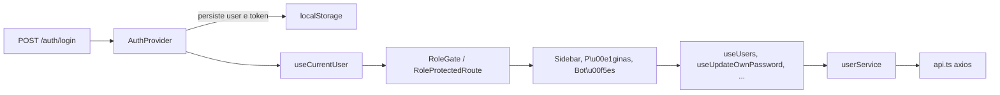

# Plano: Gestão de usuários e controle por role no frontend

## 1. Visão arquitetural

Vamos seguir a separação em 3 camadas já adotada (`services` → `hooks` → `components`/`pages`) e introduzir um pequeno núcleo de controle de acesso reutilizável.



## 2. Fundação: tipos, storage e Auth

- Adicionar `UserRole = "ADMIN" | "EDITOR" | "USER"` e `AuthenticatedUser { name, email, role }` em [front/src/types/auth.ts](front/src/types/auth.ts) (novo).
- Atualizar [front/src/features/auth/types.ts](front/src/features/auth/types.ts) `LoginResponse` para `{ token, name, email, role }` (já vem assim do backend).
- Criar `userStorage` em [front/src/utils/userStorage.ts](front/src/utils/userStorage.ts) (mesmo padrão do `tokenStorage`, persistindo `{name, email, role}` em localStorage com base64 e TTL) — evita decodar JWT no cliente.
- Atualizar [front/src/contexts/AuthContext.ts](front/src/contexts/AuthContext.ts) e [front/src/contexts/AuthProvider.tsx](front/src/contexts/AuthProvider.tsx):
  - `login(token, user)` salva token + user em storage.
  - Expor `user: AuthenticatedUser | null` e helpers `hasRole(...roles)`, `isAdmin`, `canEdit` (`ADMIN | EDITOR`).
  - `logout()` limpa ambos.
  - `setUser()` para o hook de troca de senha/perfil propagar mudanças locais (ex: nome).
- Atualizar [front/src/features/auth/hooks/useLogin.ts](front/src/features/auth/hooks/useLogin.ts) para chamar `login(token, { name, email, role })`.
- Adicionar hook `useCurrentUser()` em [front/src/hooks/useCurrentUser.ts](front/src/hooks/useCurrentUser.ts) (atalho semântico para `useAuth().user!`, garantindo não-nulo dentro das rotas protegidas).

## 3. Núcleo de controle de acesso

Criar a pasta `front/src/features/access/` (nova feature transversal):

- `components/RoleGate.tsx` — componente declarativo:

  ```tsx
  <RoleGate allow={["ADMIN", "EDITOR"]}>{children}</RoleGate>
  ```

  Renderiza `children` apenas se a role do usuário estiver em `allow`; suporta prop opcional `fallback`.
- `components/RoleProtectedRoute.tsx` — wrapper de `<Outlet />` que redireciona para `/sem-permissao` se a role não bate (consumido pelas rotas de admin).
- `hooks/usePermissions.ts` — retorna flags semânticas derivadas do role para evitar checagens espalhadas:
  - `canManageUsers` (ADMIN)
  - `canMutateProjects` (ADMIN, EDITOR)
  - `canDeleteProjects` (ADMIN, EDITOR)
  - `canCreateNumbers`, `canSendMedia` (ADMIN, EDITOR)
- `pages/ForbiddenPage.tsx` — página simples com `Empty` + título "Sem permissão", descrição e botão "Voltar para o dashboard".

Lazy import da página em [front/src/routes/index.tsx](front/src/routes/index.tsx) e adicionar entrada `/sem-permissao`. Também atualizar `PAGE_TITLES` em [front/src/components/AppHeader.tsx](front/src/components/AppHeader.tsx) com a entrada.

## 4. Camada de dados: service e hooks de usuários

- Criar [front/src/services/userService.ts](front/src/services/userService.ts) com:
  - `list(params)` → GET `/users`
  - `getById(id)` → GET `/users/:id`
  - `create(payload)` → POST `/users`
  - `update(id, payload)` → PUT `/users/:id`
  - `remove(id)` → DELETE `/users/:id`
  - `updateOwnPassword(payload)` → PATCH `/users/me/password`
- Criar feature [front/src/features/users/](front/src/features/users/) com:
  - `types.ts` — `User`, `UserRole`, `CreateUserPayload`, `UpdateUserPayload`, `UpdatePasswordPayload`.
  - `schemas/userSchema.ts` — `createUserSchema`, `updateUserSchema` (RHF + Zod).
  - `schemas/passwordSchema.ts` — `updatePasswordSchema` com `.refine(d => d.newPassword === d.confirmNewPassword, ...)`.
  - `hooks/useUsers.ts` — `useQuery(["users", params], userService.list)` com `keepPreviousData`.
  - `hooks/useCreateUser.ts`, `useUpdateUser.ts`, `useDeleteUser.ts` — `useMutation` invalidando `["users"]`. Tratam toasts `409` (email duplicado), `404` (não encontrado) e `400` (`You cannot delete your own user`) com mensagens claras em PT-BR.
  - `hooks/useUpdateOwnPassword.ts` — toast `401 → "Senha atual incorreta"`.

Query keys consistentes: `["users", params]` para lista, `["users", id]` para detalhe.

## 5. Página de gestão de usuários (`/usuarios`, ADMIN)

Compor em [front/src/pages/UsersPage.tsx](front/src/pages/UsersPage.tsx) seguindo o layout das outras telas (`ProjectsPage`/`TemplatesPage`):

- Header: título "Usuários" + botão `Novo Usuário`.
- Toolbar: `Input` de busca com `useDebounce` (busca server-side já suportada).
- Tabela em `front/src/features/users/components/UsersTable.tsx` usando `<table>` ao estilo do [NumbersTable.tsx](front/src/features/projects/components/numbers/NumbersTable.tsx) e o componente `Table` do shadcn:
  - Colunas: Nome, Email, Função (badge), Ações (dropdown com Editar / Excluir).
  - `UserRoleBadge` em `front/src/features/users/components/UserRoleBadge.tsx` com variantes:
    - ADMIN → `default` (vermelho leve, "Administrador")
    - EDITOR → `secondary` ("Editor")
    - USER → `outline` ("Usuário")
- Ações:
  - Excluir: `AlertDialog` de confirmação. Esconder/desabilitar quando `user.email === currentUser.email` (auto-exclusão impedida pelo backend; bloqueamos preventivamente).
  - Editar / Criar: `UserFormDialog` (uma única `Dialog` reutilizada com modo `create`/`edit`):
    - Campos: Nome, Email, Função (`Select` ADMIN/EDITOR/USER), Senha (apenas no create).
    - RHF + zodResolver. Tratamento `409` reabre o dialog destacando o campo email.
- Estados de UI: `Empty` quando vazio, `Alert destructive` em erro com botão "Tentar novamente", paginação igual às demais (Anterior/Próxima + select de itens por página).
- Skeleton: `UsersTableSkeleton` em `front/src/features/users/components/UsersTableSkeleton.tsx`.

A rota é registrada em [front/src/routes/index.tsx](front/src/routes/index.tsx) **dentro de** `<RoleProtectedRoute allow={["ADMIN"]}>` aninhado em `<AppLayout />`.

## 6. Página de perfil (`/perfil`, todas as roles)

[front/src/pages/ProfilePage.tsx](front/src/pages/ProfilePage.tsx):

- Header: "Meu perfil".
- Card "Informações da conta" — somente leitura: nome, email, role (Badge). Vem de `useCurrentUser()`.
- Card "Trocar senha" — formulário RHF/Zod com:
  - `currentPassword`, `newPassword` (min 6), `confirmNewPassword` (refine match).
  - Botão "Salvar" com `Loader2`. Toast verde em sucesso, vermelho com mensagem do backend em erro (especialmente `Invalid current password`).
  - `Eye/EyeOff` para mostrar/ocultar senha (mesmo padrão do [LoginForm](front/src/features/auth/components/LoginForm.tsx)).
- Sem dependência de `id` do usuário (a rota usa `me/password`).

## 7. App shell: sidebar dinâmico, header e dropdown do avatar

Em [front/src/components/AppSidebar.tsx](front/src/components/AppSidebar.tsx):

- Tornar `NAV_ITEMS` por role. Padrão proposto:

  ```ts
  const NAV_ITEMS = [
    { label: "Dashboard", path: "/dashboard", icon: LayoutDashboard },
    { label: "Projetos",  path: "/projetos",  icon: FolderKanban },
    { label: "Templates", path: "/templates", icon: FileText },
    { label: "Usuários",  path: "/usuarios",  icon: Users, roles: ["ADMIN"] as const },
  ]
  ```

  Filtrar com `usePermissions()`/role no render.
- Footer: substituir o avatar/`"Usuário"` hardcoded pelo `currentUser.name`. Itens do dropdown:
  - "Meu perfil" (`navigate("/perfil")`)
  - `DropdownMenuSeparator`
  - "Sair" (`logout`)

Em [front/src/components/AppHeader.tsx](front/src/components/AppHeader.tsx) adicionar entradas em `PAGE_TITLES` para `/usuarios`, `/perfil`, `/sem-permissao`.

## 8. Rotas

Atualizar [front/src/routes/index.tsx](front/src/routes/index.tsx):

- Lazy load: `UsersPage`, `ProfilePage`, `ForbiddenPage`.
- Estrutura final dentro do `ProtectedRoute → AppLayout`:
  - `/dashboard`, `/templates`, `/projetos` — todas as roles.
  - `/projetos/novo`, `/projetos/:id` continuam acessíveis (a página em si vai esconder ações para USER).
  - **Novo** sub-grupo `<RoleProtectedRoute allow={["ADMIN"]}>` com `/usuarios`.
  - `/perfil` — todas as roles.
  - `/sem-permissao` — todas as roles.
- Catch-all `*` continua para `/`.

A `RoleProtectedRoute` deve **redirecionar** (`<Navigate to="/sem-permissao" replace />`) — não renderizar a página inline — para que o `404 → /` continue distinto do "sem permissão".

## 9. Aplicar visibilidade nas features existentes

Para cada ponto, usar `RoleGate` ou `usePermissions()` (preferir o hook quando precisarmos `disabled` em vez de remover do DOM):

- [ProjectsPage.tsx](front/src/pages/ProjectsPage.tsx): envolver botão `Novo Projeto` com `<RoleGate allow={["ADMIN", "EDITOR"]}>`.
- [CreateProjectPage.tsx](front/src/pages/CreateProjectPage.tsx): adicionar guard de role na rota `/projetos/novo` via `RoleProtectedRoute` (ADMIN/EDITOR) — reaproveitando o componente.
- [ProjectCard.tsx](front/src/features/projects/components/ProjectCard.tsx): no dropdown, esconder itens "Editar Template", "Editar Mensagem" e "Excluir" para `USER`.
- [BasicDataTab](front/src/features/projects/components/tabs/BasicDataTab.tsx) / [TemplateTab](front/src/features/projects/components/tabs/TemplateTab.tsx) / [FlowMessageTab](front/src/features/projects/components/tabs/FlowMessageTab.tsx): tornar campos `readOnly` e botões "Salvar"/"Upload" ocultos para `USER` (mostrar um `Alert` informativo "Visualização somente leitura").
- [NumbersTab.tsx](front/src/features/projects/components/tabs/NumbersTab.tsx): esconder os botões "Adicionar número" e "Enviar foto" para `USER` (a tabela continua acessível). Aplicar mesmo critério em [NumbersTable.tsx](front/src/features/projects/components/numbers/NumbersTable.tsx).
- [AdvancedTab.tsx](front/src/features/projects/components/tabs/AdvancedTab.tsx): para `USER` esconder a Zona de Perigo, edição do Zabbix e o botão de copiar API Key (a key segue exposta apenas para ADMIN/EDITOR).

## 10. Tratamento global de 403 e UX de erros

Adicionar no `response.use` de [front/src/lib/api.ts](front/src/lib/api.ts) o tratamento de `403`:

- Disparar `toast.error("Você não tem permissão para realizar esta ação.")` (importar `sonner`).
- **Não** redirecionar globalmente (o `RoleProtectedRoute` já cuida das rotas; mutations em corrida de role recebem o toast).
- Manter o comportamento atual de `401 → AUTH_EXPIRED_EVENT`.

Mensagens de erro tratadas nos hooks de mutation (com fallback amigável):

- 409 (criar/atualizar usuário, criar projeto): "Já existe um usuário com esse e-mail." / "Já existe um projeto com esse nome."
- 400 (delete próprio): "Você não pode excluir o próprio usuário."
- 401 (trocar senha): "Senha atual incorreta."
- 404: "Usuário não encontrado."

## 11. Decisões de UX/UI consolidadas

- Cores das roles seguem o sistema do shadcn (`Badge` `default`/`secondary`/`outline`) para manter consistência com light/dark.
- Tabelas usam o padrão visual do `NumbersTable` (header `bg-muted`, linhas com hover) e o componente shadcn `Table` quando faz sentido (já existe em `front/src/components/ui/table.tsx`).
- Confirmação de exclusão sempre via `AlertDialog` (mesma linguagem da `AdvancedTab`).
- Loading sempre com `Loader2` + `disabled`, vazio com `Empty`, erro com `Alert destructive` + retry.
- Acessibilidade: labels em todos os inputs (`<Field>` + `<FieldLabel>`), botões com `aria-label`/`title` quando ícone-only, foco automático no primeiro campo do dialog (mesmo padrão do `AddNumberDialog`).
- Mobile: tabela com colunas opcionais escondidas em `<sm` (igual ao `NumbersTable`), ações em dropdown.

## 12. Não-objetivos / cuidados

- Não introduzimos `jwt-decode` — a comparação "é o próprio usuário?" usa `email` (único no backend).
- Não criamos endpoint `/me`; usamos `me/password` direto e mantemos os dados do usuário no `AuthContext`.
- A role no front é uma cópia do que veio no login. O backend continua sendo a fonte de verdade — qualquer divergência é mitigada pelo handler global de `403` + toast e pelas rotas/middlewares de backend já existentes.
