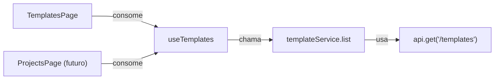

# Listagem de Templates

## Contexto

A API backend expõe `GET /templates` (autenticada) que retorna uma lista de templates Twilio pré-aprovados com os campos: `name`, `status`, `body` e `type`. A página atual ([TemplatesPage.tsx](front/src/pages/TemplatesPage.tsx)) é um placeholder.

**Reutilização**: O hook `useTemplates` e o type `Template` serão reutilizados futuramente no CRUD de Projects. Por isso, o `index.ts` da feature deve re-exportar tanto o hook quanto os types, permitindo imports limpos como `import { useTemplates, type Template } from "@/features/templates"`.

## Arquitetura (3 Camadas)

## Arquivos a criar/modificar

### 1. Type - `front/src/features/templates/types.ts`

- Definir interface `Template` com `name`, `status`, `body`, `type`

### 2. Service - `front/src/services/templateService.ts`

- Seguir padrão de [authService.ts](front/src/services/authService.ts)
- Função `list()` que faz `api.get<ApiResponse<Template[]>>("/templates")` e retorna `res.data`

### 3. Hook - `front/src/features/templates/hooks/useTemplates.ts`

- `useQuery` com queryKey `['templates']` e queryFn chamando `templateService.list()`
- Tratar erro com toast (Sonner)

### 4. Componente de lista - `front/src/features/templates/components/TemplateList.tsx`

- Tabela usando componentes `Table` do shadcn/ui
- Colunas: Nome, Tipo, Status, Body (truncado)
- Badge para o campo `status` (cores por estado: approved, pending, rejected)
- Badge para o campo `type`

### 5. Página - `front/src/pages/TemplatesPage.tsx`

- Compor a página importando `useTemplates` e `TemplateList`
- Gerenciar 3 estados da UI:
  - **Loading**: Skeleton rows na tabela
  - **Erro**: Componente `Alert` com variante `destructive`
  - **Vazio**: Componente `Empty` com ícone e mensagem
  - **Sucesso**: Renderizar `TemplateList` com os dados

### 6. Re-export - `front/src/features/templates/index.ts`

- Re-exportar hook, types e componentes da feature para consumo externo
- Permite imports como: `import { useTemplates, type Template } from "@/features/templates"`

