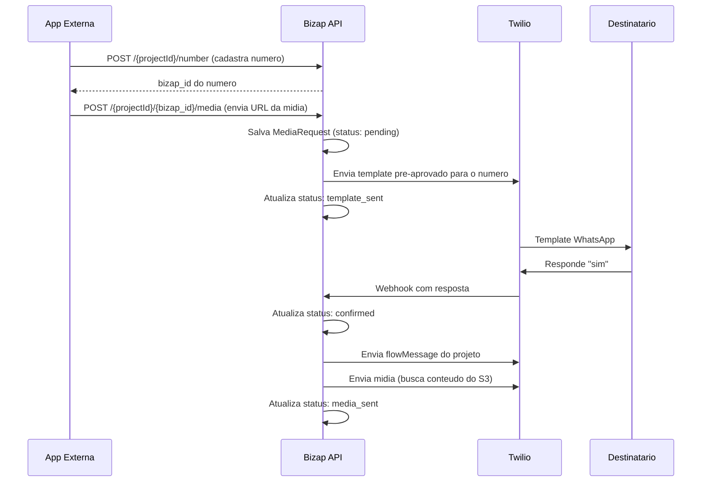

# Bizap Backend MVP

## Regras de Negocio Consolidadas

### Entidades

- **User**: Criado internamente (sem signup publico). Login por email/senha. Um usuario pode ter varios projetos.
- **Project**: Representa um "canal" de envio. Ao ser criado, gera automaticamente uma **API Key** e um **ID unico**. Campos:
  - `id` (UUID gerado)
  - `name`
  - `image` (URL ou path)
  - `phoneNumber` (numero Twilio do projeto)
  - `agency` (opcional)
  - `templateSid` (referencia ao template pre-aprovado do Twilio)
  - `flowMessage` (mensagem personalizada enviada apos o opt-in)
  - `apiKey` (chave gerada automaticamente)
  - `userId` (FK para User)
- **Number (Contato)**: Numeros de WhatsApp cadastrados por aplicacoes externas para receber templates. Campos:
  - `id` (bizap_id - usado na rota de midia)
  - `name`
  - `number` (telefone)
  - `projectId` (FK para Project)
- **MediaRequest**: Registro de cada envio de midia solicitado. Campos:
  - `id`
  - `mediaUrl` (URL da midia no S3)
  - `numberId` (FK para Number/bizap_id)
  - `projectId` (FK para Project)
  - `status` (pending, template_sent, confirmed, media_sent, failed)
  - `createdAt`

### Fluxo Principal (Core Business)




### Autenticacao (2 tipos)

- **JWT (Login)**: Para usuarios humanos gerenciando projetos, configuracoes, listagem de numeros e templates
- **API Key (Chave do Projeto)**: Apenas para as 2 rotas usadas por aplicacoes externas (cadastro de numeros e envio de midia)

### Endpoints Planejados

**Auth**

- `POST /auth/login` - Login (email/senha) -> retorna JWT

**Projects** (Auth: JWT)

- `POST /projects` - Criar projeto (gera API key + ID)
- `GET /projects` - Listar projetos do usuario
- `GET /projects/:id` - Detalhe do projeto
- `PUT /projects/:id` - Atualizar projeto
- `DELETE /projects/:id` - Deletar projeto

**Response Message** (Auth: JWT)

- `PUT /projects/:projectId/response-message` - Personalizar mensagem do fluxo

**Numbers**

- `POST /projects/:projectId/numbers` - Cadastrar numero (Auth: **API Key**) - app externa
- `GET /projects/:projectId/numbers` - Listar numeros cadastrados (Auth: **JWT**)

**Media**

- `POST /projects/:projectId/:bizapId/media` - Enviar midia (Auth: **API Key**) - app externa envia URL

**Templates** (Auth: JWT)

- `GET /templates` - Listar templates do Twilio (Name, Status, Body, Type)

**Webhook**

- `POST /webhook/twilio` - Recebe respostas dos destinatarios via Twilio (sem auth, validacao por assinatura Twilio)

## Arquitetura

```
src/
  server.ts
  app.ts
  env.ts
  lib/
    prisma.ts
    twilio.ts
    s3.ts
  modules/
    project/
      controllers/
        create-project.controller.ts
        list-projects.controller.ts
        get-project.controller.ts
        update-project.controller.ts
        delete-project.controller.ts
        update-flow-message.controller.ts
      services/
        create-project.service.ts
        list-projects.service.ts
        get-project.service.ts
        update-project.service.ts
        delete-project.service.ts
        update-flow-message.service.ts
      repositories/
        project-repository.ts              -- contrato (interface)
        prisma-project-repository.ts       -- implementacao Prisma
      routes/
        create-project.route.ts
        list-projects.route.ts
        get-project.route.ts
        update-project.route.ts
        delete-project.route.ts
        update-flow-message.route.ts
      schemas/
        project.schema.ts
    number/
      controllers/
        create-number.controller.ts
        list-numbers.controller.ts
      services/
        create-number.service.ts
        list-numbers.service.ts
      repositories/
        number-repository.ts               -- contrato (interface)
        prisma-number-repository.ts        -- implementacao Prisma
      routes/
        create-number.route.ts
        list-numbers.route.ts
      schemas/
        number.schema.ts
    media/
      controllers/
        send-media.controller.ts
      services/
        send-media.service.ts
      repositories/
        media-repository.ts                -- contrato (interface)
        prisma-media-repository.ts         -- implementacao Prisma
      routes/
        send-media.route.ts
      schemas/
        media.schema.ts
    template/
      controllers/
        list-templates.controller.ts
      services/
        list-templates.service.ts
      routes/
        list-templates.route.ts
      schemas/
        template.schema.ts
    auth/
      controllers/
        login.controller.ts
      services/
        login.service.ts
      routes/
        login.route.ts
      schemas/
        auth.schema.ts
    webhook/
      controllers/
        twilio-webhook.controller.ts
      services/
        twilio-webhook.service.ts
      routes/
        twilio-webhook.route.ts
  middlewares/
    auth-jwt.ts
    auth-api-key.ts
  utils/
    generate-api-key.ts
    errors.ts
  prisma/
    schema.prisma
```

**Padrao por modulo:**

- `controllers/` - um arquivo por acao (recebe request, chama service, retorna response padronizada)
- `services/` - um arquivo por acao (regra de negocio, chama repository, lanca `ApplicationError` em caso de erro)
- `repositories/` - contrato (interface TypeScript) + implementacao Prisma (inversao de dependencia)
- `routes/` - um arquivo por acao (define rota, schema Zod, auth, chama controller)
- `schemas/` - schemas Zod compartilhados do modulo

### Resposta padronizada dos controllers

Todos os controllers retornam o mesmo formato:

```typescript
// Sucesso
{
  success: true,
  message: "Project created successfully",
  data: { ... }
}

// Erro (tratado pelo error handler global)
{
  success: false,
  message: "Project not found",
  data: null
}
```

### ApplicationError (`src/utils/errors.ts`)

Erro customizado usado nos services para lancar erros com mensagem e status code:

```typescript
class ApplicationError extends Error {
  public readonly statusCode: number

  constructor(message: string, statusCode: number = 400) {
    super(message)
    this.name = 'ApplicationError'
    this.statusCode = statusCode
  }
}
```

O error handler global do Fastify captura `ApplicationError` e retorna a resposta padronizada `{ success: false, message, data: null }` com o status code correto. Erros nao tratados retornam 500.

## Stack Tecnica

- **Runtime**: Node.js
- **Framework**: Fastify
- **Linguagem**: TypeScript
- **Validacao**: Zod (com `@fastify/type-provider-zod` ou `fastify-zod`)
- **Docs**: Swagger (`@fastify/swagger` + `@fastify/swagger-ui`)
- **ORM**: Prisma (MySQL)
- **Auth**: JWT (`@fastify/jwt`)
- **Twilio**: SDK oficial `twilio`
- **S3**: `@aws-sdk/client-s3`

## Variaveis de Ambiente

```
DATABASE_URL=mysql://...
JWT_SECRET=...
TWILIO_ACCOUNT_SID=...
TWILIO_AUTH_TOKEN=...
TWILIO_PHONE_NUMBER=...
AWS_S3_BUCKET=...
AWS_REGION=...
AWS_ACCESS_KEY_ID=...
AWS_SECRET_ACCESS_KEY=...
```

