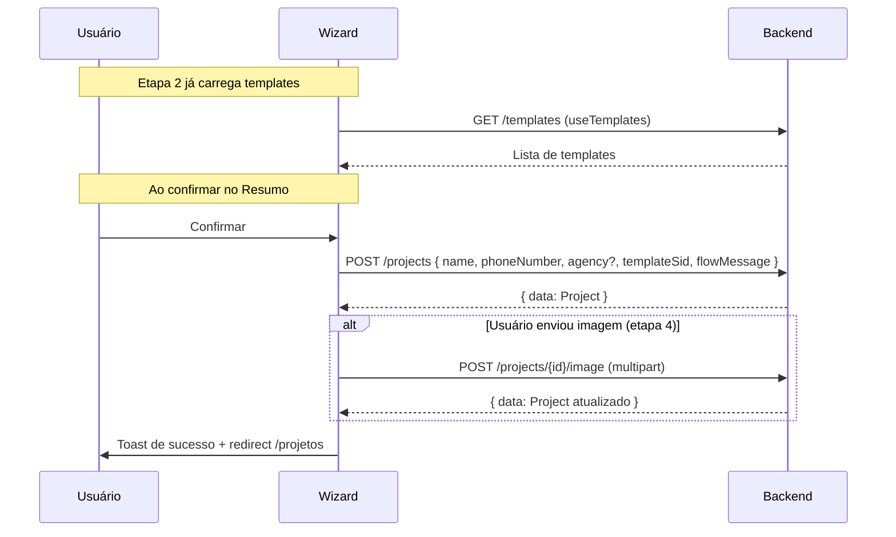

# Feature: Wizard de Criação de Projeto

Implementar uma página multi-step `/projetos/novo` para criação de projetos, seguindo a arquitetura 3 camadas (Service → Hook → Component) e as regras dos workflows.

## Fluxo das Requisições



> [!IMPORTANT]
> A criação segue **2 requisições sequenciais**: primeiro `POST /projects` para obter o `id`, depois `POST /projects/{id}/image` (se houver imagem). Se o upload falhar, o projeto já está criado — o usuário pode tentar novamente depois.

---

## Proposed Changes

### 1. Types & Schema

#### [MODIFY] [types.ts](file:///d:/Documentos/PROJETOS%20BIZSYS/Bizap/front/src/features/projects/types.ts)

Adicionar type do body de criação:

```typescript
export interface CreateProjectPayload {
  name: string
  phoneNumber: string
  agency?: string
  templateSid: string
  flowMessage: string
}
```

#### [NEW] [createProjectSchema.ts](file:///d:/Documentos/PROJETOS%20BIZSYS/Bizap/front/src/features/projects/schemas/createProjectSchema.ts)

Schema Zod para validação do wizard. **Um schema principal com todos os campos** — validação por etapa feita com `pick()`:

```typescript
import { z } from "zod"

export const createProjectSchema = z.object({
  name: z.string().min(1, "Nome é obrigatório"),
  phoneNumber: z.string().min(1, "Telefone é obrigatório"),
  agency: z.string().optional(),
  templateSid: z.string().min(1, "Selecione um template"),
  flowMessage: z.string().min(1, "Mensagem de resposta é obrigatória"),
})

export type CreateProjectFormData = z.infer<typeof createProjectSchema>

// Sub-schemas por etapa (para validação parcial)
export const basicDataSchema = createProjectSchema.pick({
  name: true,
  phoneNumber: true,
  agency: true,
})

export const templateSchema = createProjectSchema.pick({
  templateSid: true,
})

export const flowMessageSchema = createProjectSchema.pick({
  flowMessage: true,
})
```

---

### 2. Service Layer

#### [MODIFY] [projectService.ts](file:///d:/Documentos/PROJETOS%20BIZSYS/Bizap/front/src/services/projectService.ts)

Adicionar funções [create](file:///d:/Documentos/PROJETOS%20BIZSYS/Bizap/back/src/modules/project/routes/create-project.route.ts#7-20) e `uploadImage`:

```typescript
async function create(data: CreateProjectPayload): Promise<ApiResponse<Project>> {
  const response = await api.post<ApiResponse<Project>>("/projects", data)
  return response.data
}

async function uploadImage(projectId: string, file: File): Promise<ApiResponse<Project>> {
  const formData = new FormData()
  formData.append("file", file)
  const response = await api.post<ApiResponse<Project>>(
    `/projects/${projectId}/image`,
    formData,
    { headers: { "Content-Type": "multipart/form-data" } },
  )
  return response.data
}
```

---

### 3. Hooks

#### [NEW] [useCreateProject.ts](file:///d:/Documentos/PROJETOS%20BIZSYS/Bizap/front/src/features/projects/hooks/useCreateProject.ts)

Hook `useMutation` para `POST /projects`. Invalida `["projects"]` no `onSuccess`.

#### [NEW] [useUploadProjectImage.ts](file:///d:/Documentos/PROJETOS%20BIZSYS/Bizap/front/src/features/projects/hooks/useUploadProjectImage.ts)

Hook `useMutation` para `POST /projects/{id}/image`. Invalida `["projects"]` no `onSuccess`.

---

### 4. Wizard Stepper

#### [NEW] [WizardStepper.tsx](file:///d:/Documentos/PROJETOS%20BIZSYS/Bizap/front/src/features/projects/components/WizardStepper.tsx)

Componente visual do stepper com indicadores de etapa (números + labels), highlight da etapa ativa, e checkmark para etapas concluídas. Usa shadcn/ui + Tailwind. Reutilizável:

```typescript
interface WizardStepperProps {
  steps: { label: string }[]
  currentStep: number
}
```

---

### 5. Step Components

Cada etapa é um componente isolado dentro de `features/projects/components/steps/`:

#### [NEW] [BasicDataStep.tsx](file:///d:/Documentos/PROJETOS%20BIZSYS/Bizap/front/src/features/projects/components/steps/BasicDataStep.tsx)

- Formulário com `name`, `phoneNumber`, `agency` (opcional)
- Usa campos shadcn/ui `Input` + `Field`
- Recebe form context via `useFormContext` do React Hook Form

#### [NEW] [TemplateSelectionStep.tsx](file:///d:/Documentos/PROJETOS%20BIZSYS/Bizap/front/src/features/projects/components/steps/TemplateSelectionStep.tsx)

- Grid de cards com preview de cada template usando [TemplateMockup](file:///d:/Documentos/PROJETOS%20BIZSYS/Bizap/front/src/features/templates/components/TemplateMockup.tsx#21-245) (mini view)
- Loading skeleton enquanto carrega via [useTemplates](file:///d:/Documentos/PROJETOS%20BIZSYS/Bizap/front/src/features/templates/hooks/useTemplates.ts#5-12)
- Cada card selecionável (border highlight ao selecionar)
- Botão "Ver detalhes" que abre [TemplatePreviewModal](file:///d:/Documentos/PROJETOS%20BIZSYS/Bizap/front/src/features/templates/components/TemplatePreviewModal.tsx#21-114) com informações completas
- Atualiza `templateSid` no form via `useFormContext`

#### [NEW] [FlowMessageStep.tsx](file:///d:/Documentos/PROJETOS%20BIZSYS/Bizap/front/src/features/projects/components/steps/FlowMessageStep.tsx)

- `Textarea` para escrever a `flowMessage`
- Lado-a-lado ou empilhado (mobile): [TemplateMockup](file:///d:/Documentos/PROJETOS%20BIZSYS/Bizap/front/src/features/templates/components/TemplateMockup.tsx#21-245) do template selecionado no passo anterior
- Live preview da mensagem sendo digitada

#### [NEW] [ImageUploadStep.tsx](file:///d:/Documentos/PROJETOS%20BIZSYS/Bizap/front/src/features/projects/components/steps/ImageUploadStep.tsx)

- Input de upload com drag-and-drop ou click
- Preview da imagem selecionada (circular, estilo avatar)
- Botão "Pular etapa" bem visível (etapa é opcional)
- File armazenado em `useState` local — upload só acontece após `POST /projects`

#### [NEW] [SummaryStep.tsx](file:///d:/Documentos/PROJETOS%20BIZSYS/Bizap/front/src/features/projects/components/steps/SummaryStep.tsx)

- Resumo visual de todos os dados preenchidos
- Avatar preview (se imagem foi selecionada) ou iniciais do nome
- Informações em seções: Dados, Template selecionado (com mini mockup), Mensagem de resposta
- Botões de ação por seção para "Editar" (volta para a etapa correspondente)
- Botão "Criar Projeto" que dispara a sequência `POST /projects` → `POST /projects/{id}/image`

---

### 6. Page & Routing

#### [NEW] [CreateProjectPage.tsx](file:///d:/Documentos/PROJETOS%20BIZSYS/Bizap/front/src/pages/CreateProjectPage.tsx)

Página com:
- `FormProvider` do React Hook Form (resolver Zod com `createProjectSchema`)
- Estado `currentStep` para controlar a etapa
- Navegação "Voltar" / "Próximo" com validação parcial via sub-schemas por etapa
- Lógica de submit no último step

#### [MODIFY] [index.tsx](file:///d:/Documentos/PROJETOS%20BIZSYS/Bizap/front/src/routes/index.tsx)

Adicionar rota `/projetos/novo` (lazy-loaded, dentro do `ProtectedRoute > AppLayout`):

```typescript
const CreateProjectPage = lazy(() => import("@/pages/CreateProjectPage"))
// ...
{ path: "/projetos/novo", element: <SuspenseWrapper><CreateProjectPage /></SuspenseWrapper> }
```

#### [MODIFY] [ProjectsPage.tsx](file:///d:/Documentos/PROJETOS%20BIZSYS/Bizap/front/src/pages/ProjectsPage.tsx)

Adicionar botão "Novo Projeto" no header que navega para `/projetos/novo`.

---

## Resumo de Arquivos

| Ação | Arquivo |
|---|---|
| NEW | `features/projects/schemas/createProjectSchema.ts` |
| NEW | `features/projects/hooks/useCreateProject.ts` |
| NEW | `features/projects/hooks/useUploadProjectImage.ts` |
| NEW | `features/projects/components/WizardStepper.tsx` |
| NEW | `features/projects/components/steps/BasicDataStep.tsx` |
| NEW | `features/projects/components/steps/TemplateSelectionStep.tsx` |
| NEW | `features/projects/components/steps/FlowMessageStep.tsx` |
| NEW | `features/projects/components/steps/ImageUploadStep.tsx` |
| NEW | `features/projects/components/steps/SummaryStep.tsx` |
| NEW | `pages/CreateProjectPage.tsx` |
| MODIFY | [features/projects/types.ts](file:///d:/Documentos/PROJETOS%20BIZSYS/Bizap/front/src/features/projects/types.ts) |
| MODIFY | [services/projectService.ts](file:///d:/Documentos/PROJETOS%20BIZSYS/Bizap/front/src/services/projectService.ts) |
| MODIFY | [routes/index.tsx](file:///d:/Documentos/PROJETOS%20BIZSYS/Bizap/front/src/routes/index.tsx) |
| MODIFY | [pages/ProjectsPage.tsx](file:///d:/Documentos/PROJETOS%20BIZSYS/Bizap/front/src/pages/ProjectsPage.tsx) |

## Verification Plan

### Build Check
```bash
cd d:\Documentos\PROJETOS BIZSYS\Bizap\front && npx tsc --noEmit
```

### Manual Verification
1. Navegar para `/projetos` → clicar "Novo Projeto" → abrir wizard
2. Preencher etapa 1 (dados básicos) → validar campos obrigatórios
3. Selecionar template na grade → abrir modal de preview → confirmar seleção
4. Escrever flowMessage → verificar preview ao vivo
5. Testar upload de imagem + pular etapa
6. Resumo → verificar dados → voltar em etapa específica → alterar → confirmar
7. Submeter → verificar toast de sucesso → redirect para `/projetos`
8. Testar cenários de erro (API fora, campos inválidos)
